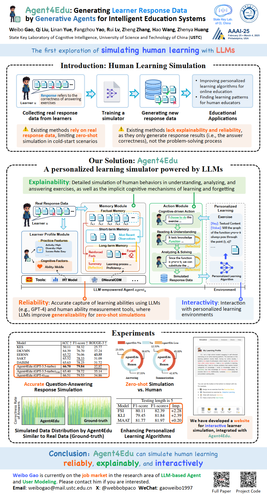

Thank you for your attention!
---
- 2025-05-10: The code is being continuously updated, and the irt and dneuralcdm tools will be uploaded soon.
- 2025-03-10: Upload the presentation slide. [[Download Slide PDF](./Agent4Edu-Slide_web.pdf)]
- 2025-03-10: Note: [In English] Weibo Gao will update this project as soon as he finishes his dissertation by the end of March 2025! [In Chinese] 高维博将在完成毕业论文（2025年3月底）后，立刻更新本项目！

Paper Information
---

Title: Agent4Edu: Generating Learner Response Data by Generative Agents for Intelligent Education Systems

Paper: https://arxiv.org/pdf/2501.10332

Authors:
- Weibo Gao (The First Author)
  - Homepage: http://home.ustc.edu.cn/~weibogao
  - Email: weibogao@mail.ustc.edu.cn
  - X: @webbobpaco
  - WeChat: gaoweibo1997
  - Weibo Gao is currently on the job market in the research area of LLM-based Agent and User Modeling. Please contact him if you are interested.

- Qi Liu (Corresponding Author)
  - Homepage: http://staff.ustc.edu.cn/~qiliuql/
  - Email: qiliuql@ustc.edu.cn

Presentation @AAAI-2025
---

Thanks to [Guanhao Zhao](https://github.com/ghzha0) for giving the on-site presentation on my behalf at AAAI. Feel free to interact with him on-site or email the first author ([Weibo Gao](http://home.ustc.edu.cn/~weibogao)) at weibogao@mail.ustc.edu.cn.

Our presentation information is as follows:

- Session: Applications 5
- LOCATION: 115 A
- Time: Friday February 28, 11:15am-12:30pm
- Paper ID: 1539
- Paper Title: Agent4Edu: Generating Learner Response Data by Generative Agents for Intelligent Education Svstems


Poster
---


[Download Poster PDF](./Agent4Edu-poster.pdf)


Application Website
---
We have developed a website for interactive learner practice simulation, integrated with Agent4Edu.


The website is currently in internal testing and will be launched soon. The full code and data will be released on the website.

Please follow our GitHub project for updates~

BibTxt
---
```
@article{gao2025agent4edu,
  title={Agent4Edu: Generating Learner Response Data by Generative Agents for Intelligent Education Systems},
  author={Gao, Weibo and Liu, Qi and Yue, Linan and Yao, Fangzhou and Lv, Rui and Zhang, Zheng and Wang, Hao and Huang, Zhenya},
  journal={arXiv preprint arXiv:2501.10332},
  year={2025}
}
```
